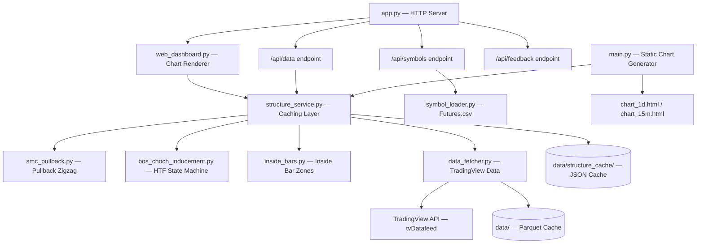

# Architecture

## System Overview
The Liquidity Market Structure Analyzer is a Python-based web application that retrieves financial market OHLC data from TradingView, runs rules-based SMC (Smart Money Concepts) analysis to identify key liquidity structures (Pullbacks, Inducements, Break of Structure, Change of Character), and renders interactive candlestick charts via a web dashboard.

## Component Diagram


## Module Reference

| Module | Purpose |
|---|---|
| `app.py` | HTTP server — routes `/`, `/api/data`, `/api/symbols`, `/api/feedback` |
| `web_dashboard.py` | Server-rendered interactive chart using `lightweight-charts` Python library |
| `dashboard.html` | Standalone client-side SPA dashboard (fetch-based, uses `/api/data`) |
| `structure_service.py` | Orchestrates all analysis modules; persistent JSON caching under `data/structure_cache/` |
| `smc_pullback.py` | Pullback zigzag swing detection with open-gap-break and proximity logic |
| `bos_choch_inducement.py` | HTF state machine: Inducement (`#`), Inducement Shift (`IS`) for wick breaks, BOS, ChoCH |
| `inside_bars.py` | Inside bar zone detection (pink rectangles) |
| `data_fetcher.py` | TradingView API connection and local Parquet caching |
| `symbol_loader.py` | Loads 215+ NSE Futures symbols from `Futures.csv` |
| `main.py` | Static chart generator — outputs `chart_1d.html` and `chart_15m.html` |
| `market_structure.py` | Legacy structure analyzer (superseded by `bos_choch_inducement.py`) |

## Data Flow
1. **Request**: User visits `http://127.0.0.1:8080/` or calls `/api/data?symbol=X&timeframe=Y`.
2. **Cache Check**: `structure_service.py` checks `data/structure_cache/{symbol}_{tf}.json` for a valid cache (matches `last_timestamp` and `total_candles`).
3. **Data Fetching**: On cache miss, `data_fetcher.py` checks `data/` for Parquet cache, fetches recent bars from TradingView, and merges.
4. **Analysis Pipeline**: `smc_pullback.py` → swing highs/lows → `bos_choch_inducement.py` (tracks wick sweeps for Inducement Shifts, determines BOS/ChoCH) → HTF events → `inside_bars.py` → zones.
5. **Caching**: Results are saved to `data/structure_cache/` for < 10ms subsequent loads.
6. **Rendering**: `web_dashboard.py` renders a `lightweight-charts` interactive chart with all overlays (pullback line, HTF markers, inside bar boxes).

## Directory Structure
```text
.
├── app.py                    # HTTP server entry point
├── web_dashboard.py          # Server-rendered chart (lightweight-charts)
├── dashboard.html            # Standalone client-side SPA
├── main.py                   # Static chart generator
├── smc_pullback.py           # Pullback swing detection
├── bos_choch_inducement.py   # BOS/ChoCH/Inducement state machine
├── inside_bars.py            # Inside bar zone detection
├── structure_service.py      # Caching orchestrator
├── data_fetcher.py           # TradingView data access
├── symbol_loader.py          # Symbol list from Futures.csv
├── market_structure.py       # Legacy analyzer (deprecated)
├── Futures.csv               # 215+ NSE Futures symbols
├── data/                     # Parquet OHLC cache
│   └── structure_cache/      # Computed structure JSON cache
├── docs/                     # Project documentation
└── GEMINI.md                 # AI agent project rules
```
